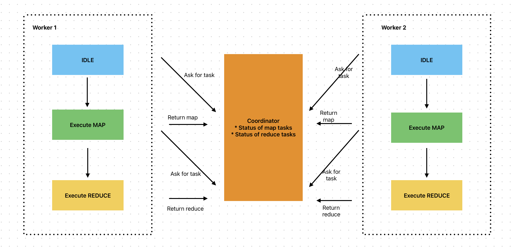

# MapReduce Distributed System Project

## Overview

This project implements a MapReduce distributed system, including worker nodes that execute map and reduce tasks and a coordinator node that manages task assignments and monitors task completion. The system is designed to handle large-scale data processing tasks efficiently and fault-tolerantly.

### Execution Flow

1. Splits input files into M Map tasks, where in our case each input file is a single map task.
2. Initializes the program across a cluster of nodes and one of which is the coordinator.
3. The coordinator assigns Map tasks to worker nodes, which read the input content and pass it to the user-defined map function and in the end write the intermediate key-value pairs into local disk.
4. These key-value pairs on the local disk are partitioned into R parts using `hash(key) mod R` and a reduce worker will be notified by the coordinator about the address of the intermediate data and read them using remote procedure calls.
5. After reading the data, the reduce worker sorts the data via its key and passes the key and its corresponding set of values to the reduce function and append the output to the final output file. **[If the amount of intermediate data is too large to fit in memory while sorting, an external sort will be used.]**
6. When all map and reduce tasks have been completed successfully, the coordinator will notify the workers to shut down.

## Features

### Map Phase

- **Intermediate Data Division**: The map phase divides intermediate keys into buckets for `nReduce` reduce tasks, where `nReduce` is the number of reduce tasks.
- **Intermediate Data File Format**: `mr-out-map_task_id-ihash%nReduce`; the last part determines which worker will execute the corresponding reduce task.

### Workers

- **Communication**: Workers communicate with the coordinator via RPC.
- **Task Handling**:
  - **Request Tasks**: Workers ask the coordinator for tasks.
  - **Execute Tasks**: Workers read task input from one or more files, execute the task, and write the task’s output to one or more files.
  - **Report Status**: Workers report their task state (MAP/REDUCE) to the coordinator.
- **Functionalities**:
  - Ask the coordinator for tasks.
  - Report task status to the coordinator.
  - Execute map and reduce tasks.

### Coordinator

- **Task Management**:
  - Reassigns tasks if a worker hasn’t completed its task within a reasonable amount of time (ten seconds).
- **Communication**:
  - Only replies to workers to assign map or reduce tasks.

## RPC Design

### Message Types

- **Types**:

  - **RequestTask**: Worker requests a task from the coordinator.
  - **AssignMapTask**: Coordinator assigns a map task to the worker.
  - **AssignReduceTask**: Coordinator assigns a reduce task to the worker.
  - **SucceedMapTask**: Worker reports a successful map task.
  - **FailMapTask**: Worker reports a failed map task.
  - **SucceedReduceTask**: Worker reports a successful reduce task.
  - **FailReduceTask**: Worker reports a failed reduce task.
  - **ShutdownWorker**: Coordinator tells the worker to shut down.
  - **HoldWorker**: Coordinator tells the worker to hold on.

- **Worker Requests**:
  - Workers request tasks from the coordinator.
  - Workers return map and reduce results.
- **Coordinator Responses**:
  - Coordinator assigns map or reduce tasks to workers.
  - Coordinator informs workers to become idle or exit.
